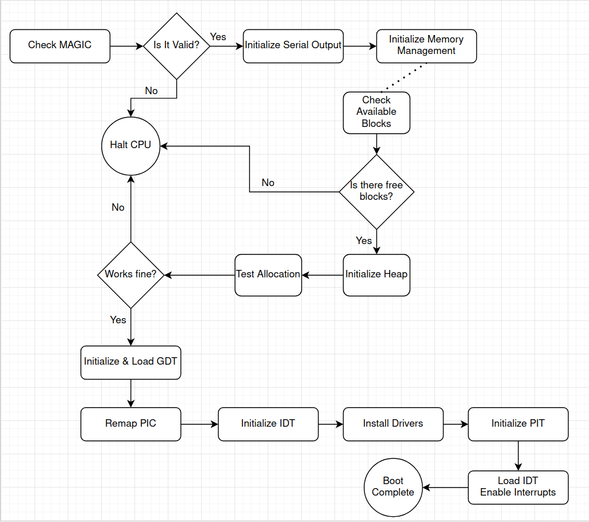
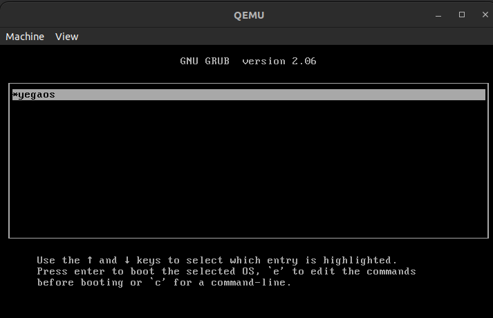

# YegaOS - A Minimal x86 Hobby Kernel

> Goal: Understand how an operating system works from the ground up by writing a minimal kernel in C and Assembly for the x86 architecture.

## Table of Contents

- [Overview](#overview)
    
- [Features](#features)
    
- [Project Structure](#project-structure)
    
- [How It Works](#how-it-works)
    
- [Build & Run](#build--run)
    
- [Debugging](#debugging)
    
- [What’s Next](#whats-next)
    
- [References](#references)
    
---
## Overview

I built this project to dive deep into understanding **Operating System fundamentals**: bootloading, interrupts, memory management, CPU architecture and low-level system programming. This kernel runs in **32-bit Protected Mode**, boots via **GRUB**, and includes basic timer and keyboard drivers, a custom heap allocator, and interrupt handling. 

Most of the effort went into understanding the architecture rather than writing code. Every feature of the kernel needed digging into legacy features, assembly instructions, memory alignment, ELF structure and Multiboot spec.

This project helped me:
- Revisit OS concepts beyond university level
- Write low-level C and assembly 
- Understand why modern OSes work the way they do

---
## Features

1. **Boot**
	- GRUB + Multiboot compliant
	- Custom linker script for memory layout
	- VGA text mode buffer for `Hello, Welcome to Yega kernel!`
	- Serial output for debugging

2. **Descriptor Tables**
	- Global Descriptor Table (**GDT**)
	- Interrupt Descriptor Table (**IDT**)

3. **Interrupts & PIC**
	- CPU exceptions
	- Hardware Interrupt (IRQ) handling
	- PIC remapping 

4. **Drivers**
	- Keyboard driver to print pressed keys
	- Timer driver to tick at 100 Hz

5. **Memory Management**
	- Parse Multiboot memory map
	- Print free blocks
	- Initialize heap
	- Implement `kalloc` and `kfree` with First-Fit approach
	- Memory Alignment for heap and allocations

6. **Debugging**
	- `GDB` with `QEMU`
	- Inspect registers such as, `PIC` registers, `EFLAGS` and segment registers

---
## Project Structure

```
.
├── boot/               # Bootloader code (Multiboot header)
├── gdt/                # Global Descriptor Table setup
├── idt/                # Interrupt Descriptor Table & IRQs
│   ├── irq/            # IRQ handling
│   └── isr/            # Exception handling
├── drivers/            # Keyboard, Timer, Serial drivers
├── kernel/             # Core kernel logic & memory management
├── display/            # VGA text mode output
├── grub/               # GRUB config
├── include/            # Header files
├── iso/                # ISO build directory for GRUB boot
├── linker/             # Linker script
├── build/              # Compiled objects & ISO
└── Makefile            # Build automation
```

---
## How It Works



---
## Requirements

- `qemu-system-i386` or `qemu-system-x86_64`
- `i686-elf-gcc` cross-compiler
- `make`
- `nasm`
- `gdb-multiarch` (for debugging)

---
## Build

```bash
make
```
This generates:

- `build/yegaos.elf` – Kernel ELF binary

- `build/yegaos.iso` – Bootable ISO (GRUB)

---
## Run

**Standard graphical mode:**
```bash
qemu-system-i386 -cdrom build/yegaos.iso
```

**Non-graphical with serial output:**
```bash
qemu-system-i386 -cdrom build/yegaos.iso -nographic -serial mon:stdio
```

**For older machine (to inspect PIC and disable APIC):**
```bash
qemu-system-x86_64 -cdrom build/yegaos.iso -serial stdio -machine isapc
```

**To log output to a file:**
```bash
qemu-system-x86_64 -cdrom build/yegaos.iso -serial stdio -machine isapc > qemu.log 2>&1
```

---
## Debug With `GDB`

Run `QEMU` in debug mode:
```bash
qemu-system-i386 -cdrom build/yegaos.iso -nographic -serial mon:stdio -s -S
```

Attach `GDB`:
```bash
gdb-multiarch build/yegaos.elf
(gdb) target remote localhost:1234
(gdb) break kernel_main
(gdb) continue
```

---
## What's Next

- Virtual memory and paging
- `printf` and basic `stdio`-like functions
- Multitasking between dummy tasks
- Porting my mini shell into the kernel

---
## Screenshots





---
## **References**

- [OSDev Wiki](https://wiki.osdev.org)
- _Operating Systems: Three Easy Pieces_
- _Operating System Concepts_ (Silberschatz, Galvin)
- [Bran's Kernel Dev Tutorial](https://web.archive.org/web/20130905193045/http://www.osdever.net/tutorials/view/brans-kernel-development-tutorial)
- [Multiboot Spec](https://www.gnu.org/software/grub/manual/multiboot/multiboot.txt)

---
## **License**

This project is released under the **MIT License**. See [LICENSE](LICENSE) for details.
